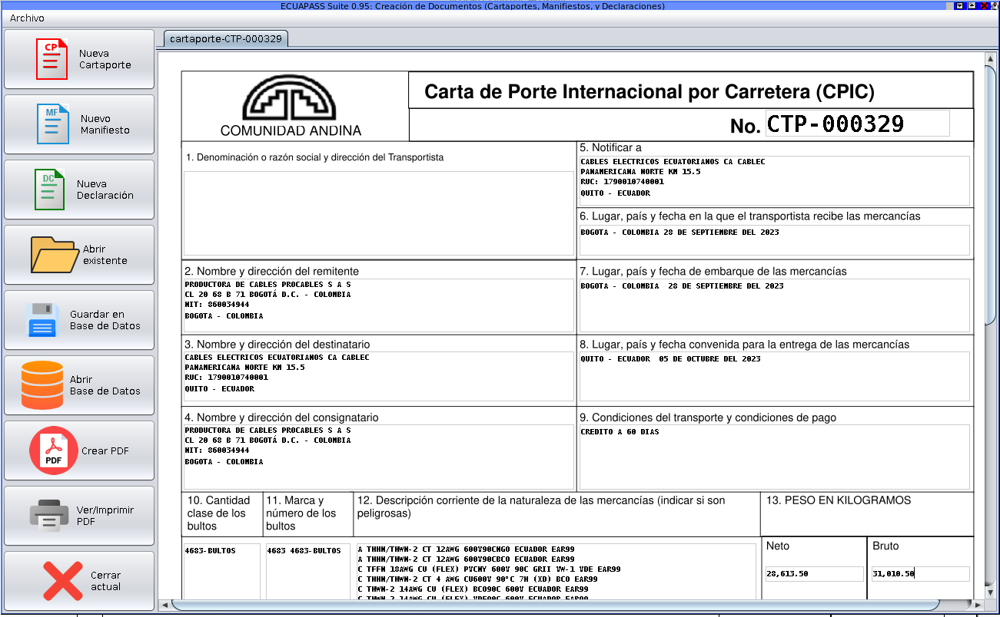
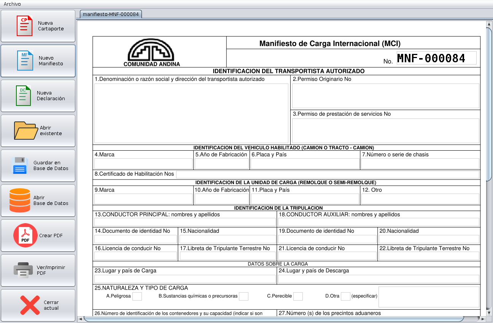
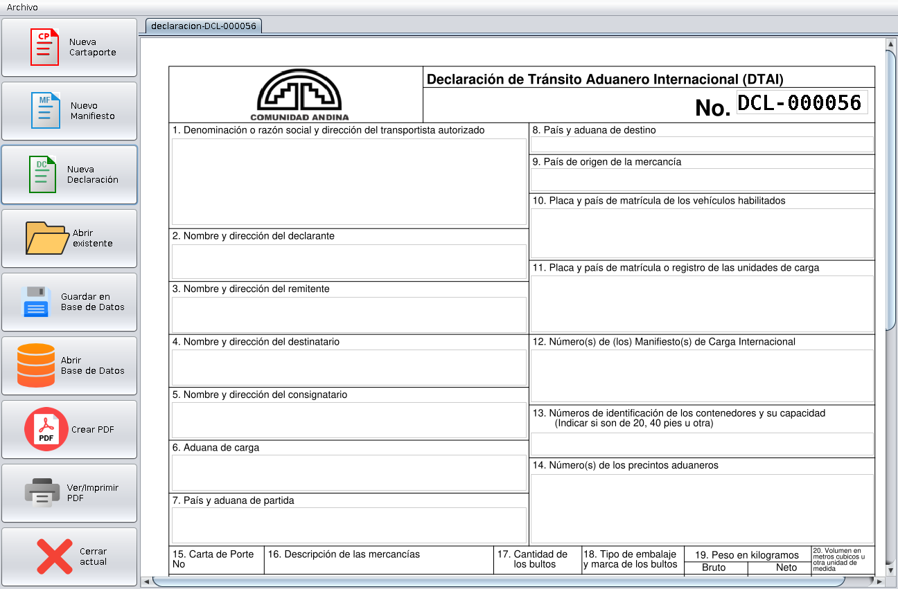
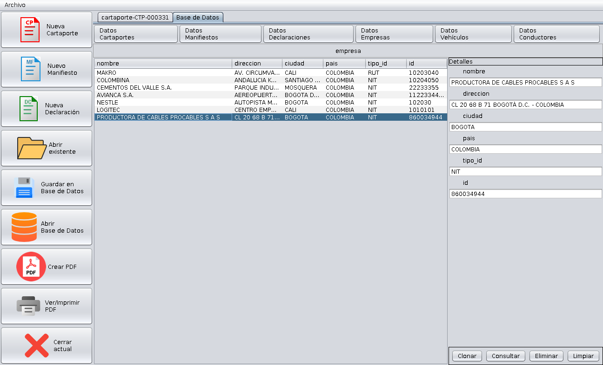
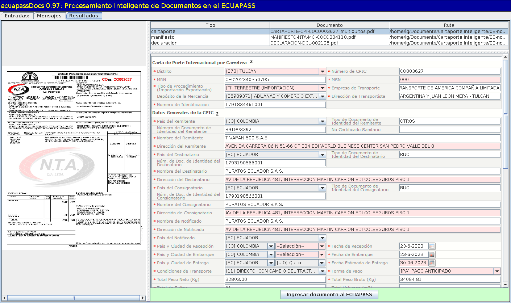
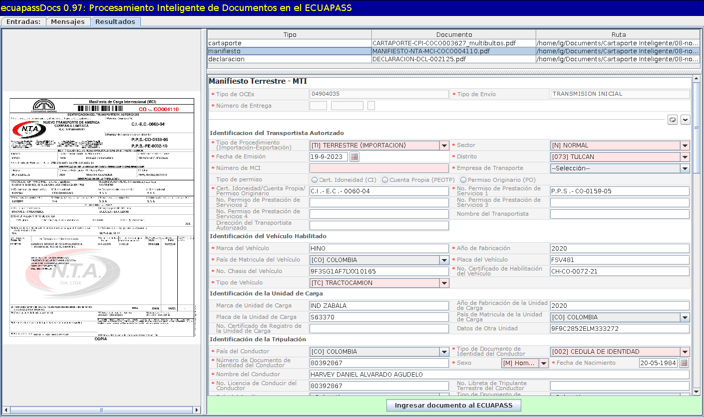
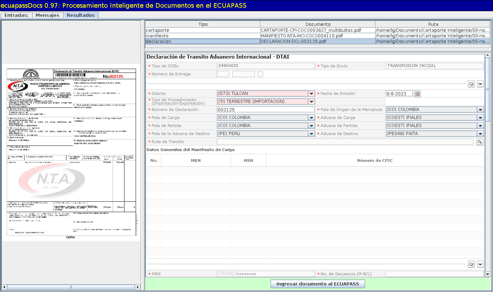

# Ecuapass-Docs:

## Software de Manejo Inteligente de Documentos en el Sistema ECUAPASS

	
	
	
	
	
	
	

La Suite de Manejo Inteligente de Documentos en el Sistema de Aduanas del Ecuador “ECUAPASS”, es una solución integral e innovadora diseñada para agilizar y optimizar la gestión de los documentos necesarios para el transporte terreste internacional: cartas de porte (CPIC), manifiestos de carga (MCI), y declaraciones de tránsito (DTAI).

La suite consta de dos módulos: 

- **Módulo Creador** que permite la creación, almacenamiento y consulta de los tres tipos de documentos: cartas de porte, manifiestos, y declaraciones. 

- **Modulo Digitador** que permite transmitir o digitar de forma *automática* cualquiera de los tres documentos (CPI, MCI, DTAI) al sistema ECUAPASS.

A continuación se describen de forma más detallada las funcionalidades y beneficios de cada módulo.

## Módulo de Creación de Documentos

Permite crear los documentos de forma amigable, rápida y precisa. El documento se elabora en una aplicación Web identica al formato de papel, lo cual evita confusiones al llenar los datos del documento. Además, muchos de los campos de cada documento se llenan automáticamente, gracias a un autocompletado inteligente que toma los datos exactos que aparecen en los documentos relacionados o que y están en la base de datos. 

## Módulo de Digitación Automática

Este módulo primero extrae la información del documento, ya sea una carta de porte, manifiesto, o declaración, luego toma inteligentemente los datos necesarios para ingresarlos en el sistema ECUAPASS, y finalmente los digita de forma completamente automática al sistema ECUAPASS en cuestión de segundos y sin errores.

Puede observar estos videos en YouTube para una mejor apreciación de las aplicaciones de este módulo:
